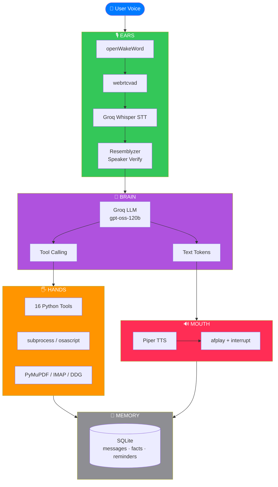

# Remy

### A fully local, privacy-first AI voice assistant for macOS

Natural voice interaction, real system control, and native tool calling — engineered for developers who value speed, privacy, and craft.

[](https://www.python.org/)
[](https://www.apple.com/macos/)
[](https://flet.dev/)
[](https://groq.com/)
[](LICENSE)
[](https://github.com/YOUR_USERNAME/remy/pulls)

<br />

**[Overview](#-overview)** · **[Features](#-features)** · **[Architecture](#-architecture)** · **[Quick Start](#-quick-start)** · **[Tools](#-built-in-tools)** · **[Configuration](#%EF%B8%8F-configuration)** · **[Roadmap](#-roadmap)** · **[License](#-license)**

</div>

---

## 📌 Overview

**Remy** is a voice-controlled AI assistant that runs natively on macOS. It listens for the wake word **"Hey Jarvis"**, understands natural language through a streaming LLM, and executes real tasks on your machine — launching applications, reading PDFs, searching the web, checking email, adjusting system settings, and more.

Remy was built around three engineering principles:

| Principle | Implementation |
| :--- | :--- |
| **Privacy-first** | Voice and prompt data stay in your control. Swappable to a fully offline stack (Ollama + `faster-whisper` + Piper). |
| **Low latency** | Streaming STT and streaming TTS pipeline. First audio token in < 1 second on M-series chips. |
| **Extensible by design** | Every capability is a Python function with a JSON schema. Adding a new tool takes ~10 lines. |

---

## ✨ Features

### 🎙️ Voice Pipeline

- **Wake word detection** — `openWakeWord` ("Hey Jarvis")
- **Speaker verification** — `Resemblyzer`; only the enrolled voice is accepted
- **Voice Activity Detection** — `webrtcvad` (aggressiveness level 3)
- **Streaming STT** — Groq Whisper Large v3 Turbo (~216× real-time)
- **Streaming TTS** — Piper + `afplay`, spoken sentence-by-sentence
- **Barge-in / interrupt** — speak while Remy talks to stop playback
- **Conversation mode** — one wake word, then continuous dialogue

### 🧠 Intelligence Layer

- **LLM** — Groq `openai/gpt-oss-120b` (streaming + native tool calling)
- **Memory** — SQLite (`messages`, `facts`, `reminders`)
- **Tool calling** — Parallel function calls with schema validation
- **System prompt** — Tuned for concise, natural, TTS-safe output
- **Multi-turn context** — Automatic session windowing

### 🎨 Interface

- **Flet desktop app** — Native macOS window
- **Apple-inspired design** — SF-style typography, monochrome palette
- **Animated microphone** — Pulse ring in idle / listening / speaking / active modes
- **Live transcript** — iOS Messages-style chat bubbles
- **Quick Actions** — One-tap access to 10 tools
- **Stop control** — Manual interrupt from the UI

### ⚙️ Reliability

- **Multi-tier exit** — Exit commands, shutdown commands, silence timeout
- **Graceful degradation** — Missing voice profile falls back to accept-all
- **Error recovery** — Retry-aware audio pipeline
- **Session reset** — Each wake word starts a fresh context
- **Cross-platform ready** — Designed for macOS, extensible to Linux/Windows

---

## 🏗️ Architecture

Remy is built as a **four-layer pipeline** — Ears, Brain, Hands, and Mouth — orchestrated around a SQLite memory store.

### Visual Overview



### Terminal View

```text
┌─────────────────────────────────────────────────────────────┐
│                         USER (voice)                        │
└──────────────────────────┬──────────────────────────────────┘
                           │
       ┌───────────────────▼───────────────────┐
       │                EARS                    │
       │  openWakeWord → webrtcvad → Whisper    │
       │  Resemblyzer (speaker verification)    │
       └───────────────────┬───────────────────┘
                           │  transcribed text
       ┌───────────────────▼───────────────────┐
       │                BRAIN                   │
       │  Groq LLM (gpt-oss-120b)               │
       │  Streaming + Native Tool Calling       │
       └──────┬────────────────────────┬────────┘
              │                        │
      tool calls                        text tokens
              ▼                        ▼
       ┌──────────────┐         ┌──────────────┐
       │    HANDS     │         │    MOUTH     │
       │ 16 tools     │         │ Piper TTS    │
       │ subprocess   │         │ afplay       │
       │ osascript    │         │ interrupt    │
       └──────┬───────┘         └──────┬───────┘
              │                        │
              └────────────┬───────────┘
                           ▼
                ┌────────────────────┐
                │      MEMORY        │
                │ SQLite: messages,  │
                │ facts, reminders   │
                └────────────────────┘
```

### Data Flow

1. **Wake** — `openWakeWord` fires on "Hey Jarvis"
2. **Listen** — `webrtcvad` captures the utterance, `Resemblyzer` verifies the speaker
3. **Transcribe** — Groq Whisper returns text in ~200 ms
4. **Reason** — Groq LLM streams tokens; if a tool is needed, it emits a `tool_call`
5. **Act** — The matching Python function runs (AppleScript, subprocess, PyMuPDF, etc.)
6. **Speak** — Piper synthesizes each completed sentence; `afplay` plays it with interrupt support
7. **Remember** — Both turns are persisted to SQLite

---

## 📁 Project Structure

```text
remy/
│
├── app/                              # Flet desktop application
│   ├── main.py                       # UI entry point (Apple-style)
│   └── services/
│       └── remy_service.py           # UI ↔ backend bridge
│
├── src/
│   ├── ears/                         # Input layer
│   │   ├── wake_word.py              # openWakeWord wrapper
│   │   └── listener.py               # VAD + Whisper + speaker verify
│   │
│   ├── mouth/                        # Output layer
│   │   └── speaker.py                # Piper TTS + afplay + interrupt
│   │
│   ├── hands/                        # Action layer
│   │   ├── tools.py                  # 16 tool functions + JSON schemas
│   │   └── reminder.py               # Background reminder scheduler
│   │
│   └── memory/                       # Persistence
│       └── database.py               # SQLite schema + helpers
│
├── assets/
│   ├── logo.png                      # App logo (README + UI)
│   └── logo_base64.txt               # Base64-embedded for Flet
│
├── remy.py                           # Terminal entry point
├── enroll.py                         # Voice enrollment CLI
├── requirements.txt
├── .env.example
├── .gitignore
├── LICENSE                           # MIT
└── README.md
```

---

## 🚀 Quick Start

### Prerequisites

| Requirement | Version | Notes |
| :--- | :--- | :--- |
| **macOS** | 13 (Ventura) or later | Apple Silicon recommended |
| **Python** | 3.11+ | 3.12 works; 3.14 tested |
| **Homebrew** | Latest | For `piper` and system deps |
| **Groq API key** | — | Free tier: [console.groq.com](https://console.groq.com) |
| **Piper model** | `en_US-ryan-high.onnx` | [Download here](https://huggingface.co/rhasspy/piper-voices) |

### Installation

```bash
# 1. Clone
git clone https://github.com/YOUR_USERNAME/remy.git
cd remy

# 2. Virtual environment
python3.11 -m venv venv
source venv/bin/activate

# 3. System dependencies
brew install piper

# 4. Python dependencies
pip install -r requirements.txt

# 5. Piper voice model
#    Place en_US-ryan-high.onnx and en_US-ryan-high.onnx.json in the project root

# 6. Environment variables
cp .env.example .env
# Edit .env and add your GROQ_API_KEY (and GMAIL_* for email tool)
```

### Voice Enrollment (optional, recommended)

```bash
python enroll.py
```

Speak a few sentences when prompted. This produces `voice_profile.npy`, which Remy uses to reject other speakers.

### Run

**Terminal interface:**

```bash
python remy.py
```

**Desktop interface:**

```bash
cd app
python main.py
```

---

## 🎤 Usage

### Basic Flow

```text
┌──────────────────────────────────────────────────────────────┐
│  1.  "Hey Jarvis"           →  Remy wakes:  "Yes?"           │
│  2.  "What time is it?"     →  "It's 4:32 PM."               │
│  3.  "Open Spotify"         →  Launches Spotify              │
│  4.  "Bye"                  →  "Goodbye!" (wake-word mode)   │
└──────────────────────────────────────────────────────────────┘
```

### Conversation Mode

Once woken, Remy stays in **conversation mode** until one of:

| Trigger | Behavior |
| :--- | :--- |
| `"bye"`, `"goodbye"`, `"see you"`, `"that's all"`, `"i'm done"` | Exit conversation mode, return to wake-word standby |
| `"shutdown remy"`, `"quit"`, `"exit"` | Fully terminate the program |
| **30 seconds of silence** | Auto-exit conversation mode |

### Example Commands

| You say | Remy does |
| :--- | :--- |
| *"What time is it?"* | Speaks the current time via `get_time` |
| *"Open Spotify"* | Launches Spotify via `open_app` |
| *"Read the PDF report.pdf"* | Extracts and summarizes via `read_pdf` |
| *"Search for the weather in Istanbul"* | DuckDuckGo search + summary |
| *"Read my last 5 emails"* | Gmail unread summary via `read_email` |
| *"What's on my screen?"* | Screenshot + vision analysis via `analyze_screen` |
| *"Set volume to 40"* | System volume via `set_volume` |
| *"Lock the screen"* | Locks macOS via `lock_screen` |
| *"Set an alarm for 7 AM"* | Spoken alarm at 07:00 via `set_alarm` |

---

## 🛠️ Built-in Tools

All tools are defined in `src/hands/tools.py` with JSON schemas for Groq's function calling.

| # | Tool | Category | Description |
| :-: | :--- | :--- | :--- |
| 1 | `get_time` | System | Current time (HH:MM) |
| 2 | `get_date` | System | Today's date |
| 3 | `calculate` | Utility | Evaluate a math expression |
| 4 | `set_reminder` | Productivity | Schedule a reminder (SQLite) |
| 5 | `open_app` | System | Launch any macOS app |
| 6 | `read_pdf` | Documents | Extract text from PDF (PyMuPDF) |
| 7 | `web_search` | Research | DuckDuckGo search + summary |
| 8 | `read_email` | Communication | Latest unread Gmail messages |
| 9 | `analyze_screen` | Vision | Screenshot + `moondream` analysis |
| 10 | `set_volume` | System | Set output volume (0–100) |
| 11 | `mute` | System | Mute output |
| 12 | `unmute` | System | Unmute output |
| 13 | `set_brightness` | System | Set screen brightness (0–100) |
| 14 | `sleep_mac` | System | Put Mac to sleep |
| 15 | `lock_screen` | System | Lock the screen |
| 16 | `set_alarm` | Productivity | Spoken alarm at HH:MM |

### Adding a New Tool

```python
# 1. Define the function in src/hands/tools.py
def my_tool(param: str) -> str:
    """Short description used by the LLM."""
    # ... implementation
    return f"Result: {param}"

# 2. Add the JSON schema to TOOLS
TOOLS.append({
    "type": "function",
    "function": {
        "name": "my_tool",
        "description": "What this tool does, when to use it.",
        "parameters": {
            "type": "object",
            "properties": {
                "param": {"type": "string", "description": "..."}
            },
            "required": ["param"]
        }
    }
})

# 3. Register it in handle_tool_calls() in remy.py and remy_service.py
elif name == 'my_tool':
    result = my_tool(args.get('param', ''))
```

That's it — the LLM will route to it automatically.

---

## ⚙️ Configuration

### Environment Variables

`.env` (copy from `.env.example`):

```env
# Required
GROQ_API_KEY=gsk_...

# Optional — only for read_email tool
GMAIL_USER=your_email@gmail.com
GMAIL_APP_PASSWORD=xxxx_xxxx_xxxx_xxxx
```

> **Gmail App Password:** Regular passwords don't work with IMAP. Generate one at [myaccount.google.com/apppasswords](https://myaccount.google.com/apppasswords).

### System Prompt

Edit `SYSTEM_PROMPT` in `remy.py` or `app/services/remy_service.py` to customize Remy's tone, tool-routing rules, and constraints.

### Wake Word

Edit `src/ears/wake_word.py`:

```python
_model = Model(
    wakeword_models=["hey_jarvis"],   # alexa, hey_mycroft, etc.
    inference_framework="onnx",
)
```

### Speaker Verification

Edit `src/ears/listener.py`:

```python
SIMILARITY_THRESHOLD = 0.45   # Lower = more permissive
```

Delete `voice_profile.npy` to disable verification entirely.

### Fully Local Mode

Every cloud component has a local drop-in replacement:

| Layer | Cloud (default) | Local Alternative |
| :--- | :--- | :--- |
| **LLM** | Groq `gpt-oss-120b` | Ollama (`qwen2.5:7b`, `llama3.1:8b`) |
| **STT** | Groq Whisper Turbo | `faster-whisper` (small / medium) |
| **TTS** | Piper (already local) | Piper, Kokoro, MLX-Audio |
| **Vision** | Ollama `moondream` (already local) | `llava`, `bakllava` |

---

## 🧪 Technology Stack

| Layer | Technology | Role |
| :--- | :--- | :--- |
| **UI** | [Flet](https://flet.dev/) | Cross-platform Python UI |
| **Wake Word** | [openWakeWord](https://github.com/dscripka/openWakeWord) | On-device wake word detection |
| **VAD** | [webrtcvad](https://github.com/wiseman/py-webrtcvad) | Voice activity detection |
| **STT** | Groq Whisper Large v3 Turbo | Speech-to-text (~216× real-time) |
| **Speaker ID** | [Resemblyzer](https://github.com/resemble-ai/Resemblyzer) | Voice embedding + cosine similarity |
| **LLM** | Groq `openai/gpt-oss-120b` | Reasoning + tool calling |
| **TTS** | [Piper](https://github.com/rhasspy/piper) | Offline neural text-to-speech |
| **Audio I/O** | `sounddevice`, `soundfile` | Real-time mic + playback |
| **Persistence** | SQLite | Messages, facts, reminders |
| **PDF** | [PyMuPDF](https://pymupdf.readthedocs.io/) | PDF text extraction |
| **Email** | [IMAPClient](https://imapclient.readthedocs.io/) | Gmail read access |
| **Web Search** | [ddgs](https://github.com/deedy5/ddgs) | DuckDuckGo search |
| **Vision** | Ollama `moondream` | Local screenshot analysis |

---

## 🛣️ Roadmap

- [x] Wake word + VAD + STT + TTS pipeline
- [x] 16 built-in tools with native function calling
- [x] Streaming LLM + streaming TTS
- [x] Conversation mode with multi-tier exit
- [x] Apple-inspired Flet desktop UI
- [x] Speaker verification
- [x] **v1.0 release**
- [ ] Mobile companion app (Flet Android / iOS)
- [ ] Fully offline mode (Ollama + `faster-whisper` + Piper)
- [ ] Plugin system for user-defined tools
- [ ] Multi-language support (Turkish, English)
- [ ] Home automation (HomeKit, MQTT)
- [ ] Calendar integration (Google Calendar, Apple Calendar)

---

## 🤝 Contributing

Contributions are welcome and appreciated. Please read [CONTRIBUTING.md](CONTRIBUTING.md) before opening a PR.

**Quick guide:**

```bash
# Fork the repo, then:
git checkout -b feature/your-feature
# Make changes
git commit -m "feat: add your feature"
git push origin feature/your-feature
# Open a Pull Request
```

**Guidelines:**

- Follow **PEP 8**
- Document all public functions with docstrings
- Keep PRs focused — one feature per PR
- Add tests for new tools when possible

---

## 📄 License

This project is released under the **MIT License**. See [LICENSE](LICENSE) for details.

You are free to use, modify, and distribute this software — including for commercial purposes.

---

## 🙏 Acknowledgments

Standing on the shoulders of excellent open-source work:

- **[Groq](https://groq.com/)** — Blazing-fast LLM and Whisper inference
- **[openWakeWord](https://github.com/dscripka/openWakeWord)** — On-device wake word detection
- **[Piper](https://github.com/rhasspy/piper)** — Offline neural TTS
- **[Resemblyzer](https://github.com/resemble-ai/Resemblyzer)** — Speaker verification
- **[Flet](https://flet.dev/)** — Beautiful cross-platform UI in pure Python
- **[Ollama](https://ollama.com/)** — Local vision model runtime

---

<div align="center">

### Remy

*A voice assistant that respects your privacy and your machine.*

**⭐ If you find this project useful, consider giving it a star.**

Made with ❤️ on macOS

</div>
